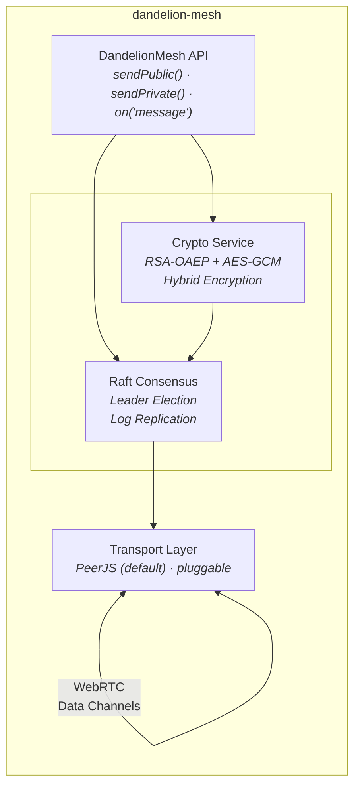
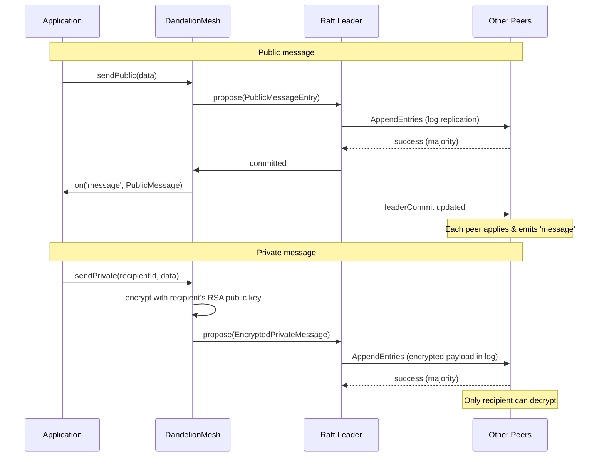
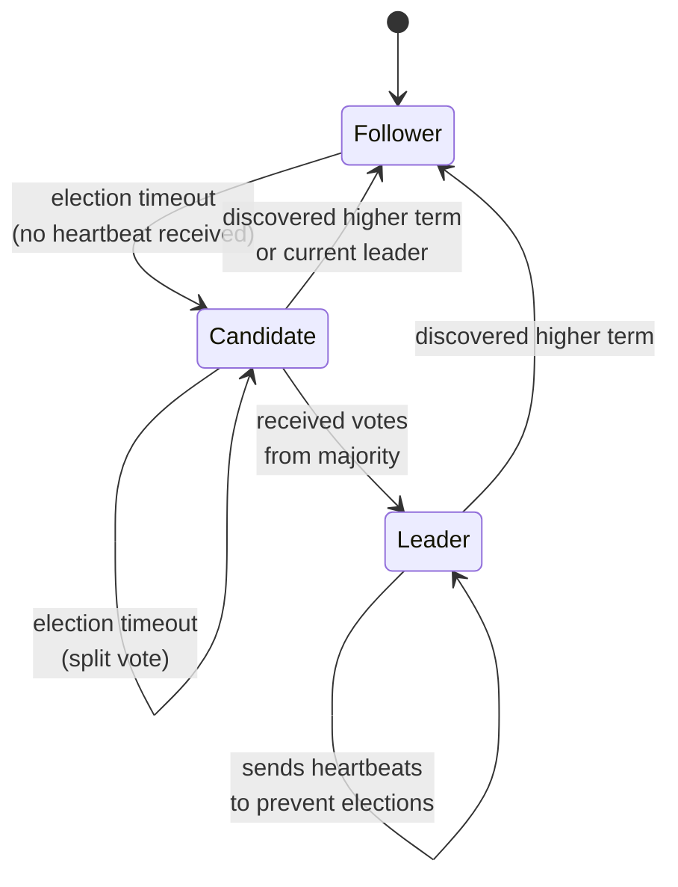

#  Dandelion Mesh

[](LICENSE)
[](https://github.com/predatorray/dandelion-mesh/actions)
[](https://codecov.io/github/predatorray/dandelion-mesh)


Serverless mesh network for browsers using WebRTC.

***Connect***, ***Broadcast***, and ***Sync State*** without a central server.

## Overview

`dandelion-mesh` is a fault-tolerant P2P service mesh library for browser applications.

It combines:
- WebRTC data channels for transport,
- RSA hybrid encryption for private messaging,
- and the Raft consensus algorithm for leader election and ordered log replication

All without requiring a dedicated server.

## Usage

### Install

```bash
npm install dandelion-mesh # not published yet
```

### Basic example

```ts
import { PeerJSTransport, DandelionMesh } from 'dandelion-mesh';

// Create a transport and mesh instance
const transport = new PeerJSTransport({ peerId: 'alice' });
const mesh = new DandelionMesh(transport, {
  bootstrapPeers: ['bob', 'charlie'],
});

// Listen for events
mesh.on('ready', (id) => {
  console.log('My peer ID:', id);
});

mesh.on('message', (msg) => {
  if (msg.type === 'public') {
    console.log(`[${msg.sender}]: ${JSON.stringify(msg.data)}`);
  }
  if (msg.type === 'private') {
    console.log(`[private from ${msg.sender}]: ${JSON.stringify(msg.data)}`);
  }
});

mesh.on('leaderChanged', (leaderId) => {
  console.log('Current leader:', leaderId);
});

mesh.on('peersChanged', (peers) => {
  console.log('Connected peers:', peers);
});

// Send messages
await mesh.sendPublic({ action: 'bet', amount: 100 });
await mesh.sendPrivate('bob', { cards: ['Ah', 'Kd'] });
```

### Using localStorage for durable sessions

```ts
import {
  PeerJSTransport,
  DandelionMesh,
  LocalStorageRaftLog,
} from 'dandelion-mesh';

const transport = new PeerJSTransport({ peerId: 'alice' });
const mesh = new DandelionMesh(transport, {
  bootstrapPeers: ['bob', 'charlie'],
  raftLog: new LocalStorageRaftLog('my-game-room'),
});

// Raft state (term, votedFor, log) persists across page refreshes,
// allowing a peer to rejoin and catch up from where it left off.
```

### Custom transport

```ts
import { Transport, DandelionMesh } from 'dandelion-mesh';

class MyWebSocketTransport implements Transport {
  // Implement the Transport interface with your own
  // connection management and message passing logic.
  // ...
}

const transport = new MyWebSocketTransport();
const mesh = new DandelionMesh(transport);
```

## High-level architecture



## Low-level architecture

### Message flow



### Leader election



### Key Design Decisions

- **Transport abstraction** — The `Transport` interface decouples the mesh from PeerJS. Any P2P transport (WebSocket, libp2p, etc.) can be plugged in by implementing the interface.

- **Raft consensus** — Full implementation per the [Raft paper](https://raft.github.io/raft.pdf):
  - Leader election with randomized timeouts (150–300ms default)
  - Log replication with AppendEntries consistency checks
  - Commitment only for current-term entries (Figure 8 safety)
  - Dynamic membership updates as peers join/leave

- **Two log backends** — `InMemoryRaftLog` for ephemeral sessions, `LocalStorageRaftLog` for peers that need to survive page refreshes and rejoin.

- **Hybrid encryption** — Private messages use RSA-OAEP to wrap a random AES-256-GCM key. Public keys are exchanged as Raft log entries, so every peer receives them through the same ordered replication path. All peers see the encrypted log entry, but only the intended recipient can decrypt it.

- **Ordered delivery via Raft** — All messages (public and encrypted private) go through Raft as log entries. Non-leader peers forward proposals to the leader. Once committed, public messages are delivered to all; encrypted messages are decrypted only by the intended recipient. This guarantees total ordering of all events across the cluster.

## Support & Bug Report

If you find any bugs or have suggestions, please feel free to [open an issue](https://github.com/predatorray/dandelion-mesh/issues/new).

## License

This project is licensed under the [MIT License](LICENSE).
